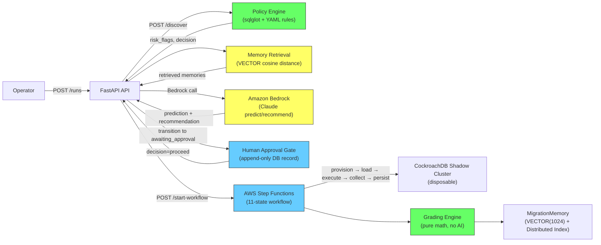
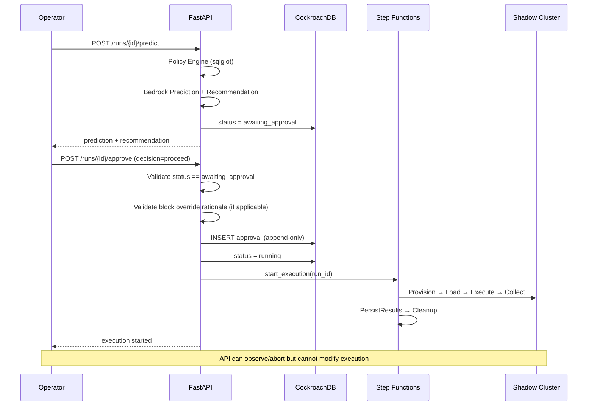
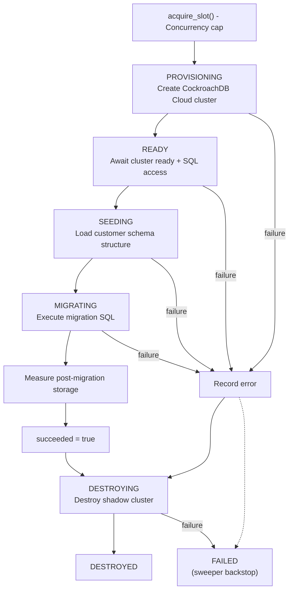

# Building an AI System That Doesn't Trust AI

*A deep technical analysis of the Migration Oracle architecture — where AI advises, but deterministic code, human gates, and AWS orchestration govern.*

---

## 1. High-Level Architecture

### Complete Request Flow

A migration submission flows through seven stages. The AI participates in exactly two. Every other stage is deterministic, human-scrutinized, or AWS-orchestrated:

```
Submit SQL (POST /runs)
    → PENDING
    → Schema Discovery (POST /runs/{id}/discover)
        → reads customer DB (read-only), snapshots tables/columns/indexes/row counts
        → stores connection_secret_arn in Secrets Manager
    → Policy Engine (deterministic, no AI)
        → sqlglot parses SQL, classifies every statement against committed YAML rules
        → produces risk_flags, policy_decision (ALLOW / ALLOW_WITH_WARNING / BLOCK)
    → AI Prediction (POST /runs/{id}/predict)
        → Memory Retrieval: vector search over CockroachDB VECTOR(1024) index
        → Bedrock Claude: predicts duration, storage, rollback risk, confidence
        → Confidence Adjustment: deterministic code ONLY reduces raw confidence
        → Bedrock Claude (second call): generates rollout recommendation
    → Human Approval (POST /runs/{id}/approve)
        → decision=proceed | accept_recommended | cancel
        → block override requires written rationale
    → AWS Step Functions Execution (POST /runs/{id}/start-workflow)
        → WorkflowOrchestrationService refuses start without prediction + proceed
        → SFN owns execution from here — API cannot modify workflow steps
        11 SFN states: DiscoverSchema → ProvisionShadowCluster → LoadSchema → 
        ExecuteMigration → CollectMetrics → PersistResults → MarkSucceeded/Failed → 
        Cleanup → WorkflowSucceeded/Failed/CleanupFailed
    → Grading & Memory (automated after PersistResults)
        → compute_numeric_grade: pure math, no model call
        → prose summary: best-effort Bedrock call, fallback templates if it fails
        → MigrationMemory written with Titan VECTOR(1024) embedding
```

### Where AI Is Involved

| Stage | AI Used | What AI Does |
|---|---|---|
| Schema Discovery | No | Deterministic SQLAlchemy introspection |
| Policy Engine | No | sqlglot AST analysis + YAML rules |
| Memory Retrieval | Yes (Titan embeddings) | VECTOR cosine distance search |
| Prediction | Yes (Bedrock Claude) | Estimate duration, storage, risk |
| Recommendation | Yes (Bedrock Claude) | Strategy, steps, monitoring checklist |
| Confidence Adjustment | No | ONLY reduces confidence, never increases |
| Human Approval | No | DB-backed, append-only audit record |
| AWS Workflow | No | Step Functions + Lambda (deterministic) |
| Grading | No | Pure math: compare prediction vs actuals |
| Memory Storage | Yes (Titan embeddings) | Embed observed outcomes for future retrieval |

### Deterministic Code Boundaries

```python
# backend/app/services/workflow_orchestration_service.py (lines 90-113)
if require_prediction_and_approval:
    if run.prediction is None:
        raise ConflictError(
            f"Cannot start workflow for MigrationRun {run_id}: "
            "prediction is required (POST /runs/{id}/predict first)"
        )
    if run.approval is None:
        raise ConflictError(
            f"Cannot start workflow for MigrationRun {run_id}: "
            "human approval is required (POST /runs/{id}/approve)"
        )
    if run.approval.decision != ApprovalDecision.PROCEED:
        raise ConflictError(
            f"Cannot start workflow: approval decision is "
            f"'{run.approval.decision.value}', need 'proceed'"
        )
```

This is the enforcement gate. Even if the API or frontend had a bug that allowed skipping prediction or approval, the service layer blocks execution.

### Mermaid Architecture Diagram



---

## 2. AI Responsibilities

### 2.1 Bedrock Prediction (Claude)

**File:** `backend/app/prediction/predictor.py`  
**Class:** `PredictionEngine.predict()`  
**Purpose:** Estimate shadow-run outcome: duration, storage, rollback risk, confidence  
**Inputs:** migration_sql, schema_snapshot, policy_analysis, retrieved_memories, scale_tier  
**Outputs:** `AdjustedPrediction` with estimated_duration_seconds, estimated_storage_mb, rollback_risk, confidence_score

```python
# backend/app/prediction/predictor.py (lines 55-95)
def predict(
    self,
    *,
    migration_sql: str,
    snapshot: DatabaseMetadata | None,
    policy: PolicyAnalysisResult,
    memories: MemoryRetrievalResult,
    scale_tier: ScaleTier | str,
) -> AdjustedPrediction:
    user_prompt = self._build_user_prompt(
        migration_sql=migration_sql, snapshot=snapshot,
        policy=policy, memories=memories, scale_tier=scale_tier,
    )
    raw_text, latency_ms, inp, out = timed_generate(
        self._client, system_prompt=self._system_prompt,
        user_prompt=user_prompt, model_id=self._model_id,
    )
    parsed, repair_retried = self._parse_with_optional_repair(
        raw_text=raw_text, user_prompt=user_prompt,
    )
    adjusted_score, adjustments = adjust_confidence(
        parsed.confidence_score, policy=policy, memories=memories,
        scale_tier=scale_tier, snapshot_total_rows=snapshot_rows,
        migration_sql=migration_sql,
    )
    # AI confidence is ONLY reduced — never increased
```

### 2.2 Bedrock Recommendation (Claude)

**File:** `backend/app/prediction/recommender.py`  
**Class:** `RecommendationEngine.recommend()`  
**Purpose:** Generate rollout strategy, steps, monitoring checklist  
**Inputs:** Same as prediction + prediction output  
**Outputs:** `RecommendationOutput` with recommended_strategy, rollout_steps, monitoring_checklist, rollback_guidance

### 2.3 Memory Retrieval (Titan Embedding)

**File:** `backend/app/memory/retrieval.py`  
**Class:** `HybridMemoryRetrieval.retrieve()`  
**Purpose:** Find similar past migrations via vector similarity + deterministic re-rank  
**Inputs:** migration_sql, statement_types, scale_tier, owner_identity  
**Outputs:** `MemoryRetrievalResult` with ranked memories, attribution, similarity scores

```python
# backend/app/memory/retrieval.py (lines 89-117)
vector = self._embed.embed(query_text)
literal = vector_to_literal(vector)
candidates = await self._repo.vector_candidates(
    query_vector_literal=literal,
    owner_identities=scopes,
    limit=pool,
)
# Deterministic re-rank (60% of final score):
scored: list[dict[str, Any]] = []
for mem, similarity in candidates:
    type_match = 1.0 if mem.migration_type == migration_type else 0.0
    tier_score = _tier_proximity(scale_tier, mem.scale_tier, adjacent)
    shape = _shape_score(...)
    flag_score = _flag_overlap(query_flag_ids, mem.risk_flags)
    final = (
        weights.semantic_similarity * similarity      # 45%
        + weights.migration_type_match * type_match   # 20%
        + weights.scale_tier_proximity * tier_score   # 15%
        + weights.schema_shape * shape                # 10%
        + weights.risk_flag_overlap * flag_score      # 10%
    ) / weight_sum
```

### 2.4 Embedding Generation (Titan)

**File:** `backend/app/memory/embedding_client.py`  
**Class:** `AwsTitanEmbeddingClient.embed()`  
**Purpose:** Generate 1024-d vector for memory storage and retrieval  
**Inputs:** text string  
**Outputs:** 1024-element float vector

### 2.5 Prose Generation (Bedrock Claude - best-effort)

**File:** `backend/app/grading/prose.py`  
**Purpose:** Generate human-readable surprise notes and lessons learned from grade data  
**Status:** Best-effort — if the call fails, deterministic fallback templates are used

### 2.6 Open Source Corpus Embedding

**File:** `backend/app/memory/open_source_corpus.py`  
**Function:** `ensure_open_source_corpus()`  
**Purpose:** Seed curated public migration incidents as retrievable memories with Titan embeddings

### 2.7 Mock Bedrock Client (Development)

**File:** `backend/app/prediction/bedrock_client.py`  
**Class:** `MockBedrockClient`  
**Purpose:** Deterministic fake for development and testing when no Bedrock model is configured

### 2.8 Embedding Repair (Maintenance)

**File:** `backend/app/memory/writer.py`  
**Function:** `repair_pending_embedding()`  
**Purpose:** Retry Titan embedding for memories that failed during initial write

---

## 3. Deterministic Components

### 3.1 Policy Engine (sqlglot + YAML)

**File:** `backend/app/policy/engine.py`  
**Class:** `PolicyEngine`  
The model never sees raw SQL. The policy engine parses it with sqlglot first.

```python
# backend/app/policy/engine.py (lines 70-100)
class PolicyEngine:
    def analyze(self, migration_sql: str, snapshot=None) -> PolicyAnalysisResult:
        statements = sqlglot.parse(migration_sql, dialect=DIALECT)
        findings: list[RiskFinding] = []
        for stmt in statements:
            findings.extend(self._analyze_statement(stmt, row_index))
        decision = max_decision(*(f.policy_decision for f in findings))
        return PolicyAnalysisResult(
            risk_flags=findings, policy_decision=decision, ...
        )
```

Rules are defined in `backend/app/policy/policy.yaml`:

```yaml
rules:
  drop_table:
    enabled: true
    base_severity: high
    policy_decision: block
    requires_manual_review: true
  index_creation:
    enabled: true
    base_severity: low
    policy_decision: allow
    escalate_by_row_count: true
```

### 3.2 Confidence Adjustment (Only Reduces)

**File:** `backend/app/prediction/confidence.py`  
**Function:** `adjust_confidence()`  
The model's raw confidence can only be reduced — never increased.

```python
# backend/app/prediction/confidence.py (lines 1-15)
# Reduction amounts (absolute). Adjustments only lower confidence.
WEAK_RETRIEVAL_REDUCTION = 0.20
SCHEMA_SIZE_MISMATCH_REDUCTION = 0.10
UNCOMMON_MIGRATION_REDUCTION = 0.08
UNUSUAL_RISK_REDUCTION = 0.15

def adjust_confidence(raw_confidence, *, policy, memories, ...):
    """Return (adjusted_confidence, adjustments). Never raises the raw value."""
    score = max(0.0, min(1.0, raw_confidence))
    adjustments: list[ConfidenceAdjustment] = []
    # ... apply reductions only ...
    return score, adjustments
```

### 3.3 Grading Engine (Pure Math)

**File:** `backend/app/grading/engine.py`  
**Function:** `compute_numeric_grade()`  
The grade is computed by comparing prediction against actuals. No model is consulted.

```python
# backend/app/grading/engine.py (lines 99-140)
def compute_numeric_grade(*, prediction, execution, scale_tier, ...):
    duration_abs = abs(predicted_duration - actual_duration)
    duration_within = _within_band(abs_error=duration_abs, max_abs=..., max_pct=...)
    storage_within = ...  # same logic
    rollback_consistent = (rollback_predicted, rollback_actual) in consistent_pairs
    
    scalar = mean of (duration_within, storage_within, rollback_consistent)
    return NumericGradeResult(scalar_accuracy_score=scalar, ...)
```

### 3.4 Orchestration Validation

**File:** `backend/app/services/workflow_orchestration_service.py` (lines 90-113)  
**Function:** `start_for_run()` with `require_prediction_and_approval=True`

Three checks before any AWS execution starts:
1. Prediction must exist
2. Approval must exist
3. Approval decision must be `proceed`

### 3.5 State Machine (ASL)

**File:** `infra/stepfunctions/migration_workflow.asl.json`  
11 deterministic states with guaranteed cleanup on all paths.

### 3.6 Orphan Sweeper

**File:** `backend/app/shadow/sweeper.py`  
**Class:** `ShadowClusterSweeper`  
DB-backed + provider-driven double check for leaked resources.

### 3.7 Slot Admission Control

**File:** `backend/app/shadow/concurrency.py`  
**Function:** `acquire_slot()`  
DB-backed concurrency cap, polls when full instead of over-provisioning.

### 3.8 Deterministic Scale Tier Selection

**File:** `backend/app/shadow/models.py`  
**Function:** `select_scale_tier()`  
Maps total estimated row count to a synthetic data tier.

---

## 4. Human Approval

### Database Model

**File:** `backend/app/database/models/approval.py`

```python
class ApprovalDecision(str, enum.Enum):
    PROCEED = "proceed"        # starts shadow execution
    ACCEPT_RECOMMENDED = "accept_recommended"  # advisory only, no execution
    CANCEL = "cancel"          # kills the run

class Approval(UUIDPrimaryKeyMixin, TimestampMixin, Base):
    __tablename__ = "approvals"
    migration_run_id: Mapped[uuid.UUID]
    approver_identity: Mapped[str]
    decision: Mapped[ApprovalDecision]
    override_rationale: Mapped[str | None]  # required when overriding BLOCK
```

### API Endpoint

**File:** `backend/app/api/routes/runs.py` (lines 155-175)

```python
@router.post("/{run_id}/approve", response_model=MigrationRunResponse)
async def approve_run(run_id, payload: ApprovalCreateRequest, service: ApprovalSvc, ...):
    """Record approval. On proceed, auto-starts the verify workflow when configured."""
    run = await service.approve(
        run_id, decision=payload.decision,
        approver_identity=approver,
        override_rationale=payload.override_rationale,
        connection_secret_arn=payload.connection_secret_arn,
        start_workflow=payload.start_workflow,
    )
```

### State Transitions

```
PENDING → PREDICTING → AWAITING_APPROVAL → {RUNNING, COMPLETED, FAILED}
                                            ↑ decision=proceed → RUNNING + SFN start
                                            ↑ decision=accept_recommended → COMPLETED
                                            ↑ decision=cancel → FAILED
```

### Approval Service Logic

**File:** `backend/app/services/approval_service.py`

```python
# The gate: only accepting when status is awaiting_approval
if run.status != MigrationRunStatus.AWAITING_APPROVAL:
    raise ConflictError(...)

# Block override enforcement: proceed against BLOCK requires rationale
if decision == ApprovalDecision.PROCEED and run.policy_decision == PolicyDecision.BLOCK:
    if not rationale:
        raise ValidationError(
            "override_rationale is required when proceeding against block"
        )

# The decision map:
_DECISION_TO_STATUS = {
    ApprovalDecision.PROCEED: MigrationRunStatus.RUNNING,
    ApprovalDecision.ACCEPT_RECOMMENDED: MigrationRunStatus.COMPLETED,
    ApprovalDecision.CANCEL: MigrationRunStatus.FAILED,
}
```

### Execution Trigger

**File:** `backend/app/services/approval_service.py` (lines 140-162)

After recording approval, if decision is `proceed` and auto-start is enabled, the service calls `WorkflowOrchestrationService.start_for_run()` which performs the three checks before any AWS execution.

### Mermaid Sequence Diagram



---

## 5. AWS Integration

### 5.1 Step Functions — Workflow Orchestration

**Why:** Provides a visitable execution record with event history. Every workflow produces an audit trail showing exactly which step failed, with what input, after how many retries. The API cannot influence execution after handoff.

**File:** `backend/app/aws/workflow/client.py`  
**File:** `infra/stepfunctions/migration_workflow.asl.json`

```python
# backend/app/aws/workflow/client.py (lines 77-110)
async def start_workflow_execution(factory, settings, start_input):
    response = await asyncio.to_thread(
        _start_execution_sync, factory,
        state_machine_arn=settings.migration_workflow_arn,
        execution_name=start_input.run_id,  # run_id as execution name (idempotent)
        execution_input=payload,
    )
    return WorkflowExecutionRef(execution_arn=response["executionArn"], ...)
```

### 5.2 Bedrock — AI Prediction and Recommendation

**Why:** Claude for structured prediction/recommendation output. Titan for embeddings.

**File:** `backend/app/prediction/bedrock_client.py`  
**File:** `backend/app/memory/embedding_client.py`

```python
# backend/app/prediction/bedrock_client.py (lines 85-110)
class AwsBedrockClient(BedrockClient):
    def generate_json(self, *, system_prompt, user_prompt, model_id=None):
        response = self._client.converse(
            modelId=mid,
            system=[{"text": system_prompt}],
            messages=[{"role": "user", "content": [{"text": user_prompt}]}],
            inferenceConfig={"temperature": 0.0, "maxTokens": 4096},
        )
        return _extract_converse_text(response)
```

```python
# backend/app/memory/embedding_client.py (lines 72-98)
class AwsTitanEmbeddingClient(EmbeddingClient):
    def embed(self, text, *, model_id=None):
        response = self._client.invoke_model(
            modelId=mid,
            body=json.dumps({"inputText": text, "dimensions": 1024, "normalize": True}),
        )
        payload = json.loads(response["body"].read())
        return [float(v) for v in payload["embedding"]]
```

### 5.3 Lambda — Step Handlers

**Why:** Each Step Functions state invokes a dedicated Lambda for its task. Defined in SAM template.

**File:** `infra/sam/template.yaml`

8 Lambda functions: discover-schema, provision-shadow-cluster, load-schema, execute-migration, collect-metrics, persist-results, cleanup, and sweeper.

### 5.4 EventBridge — Sweeper Scheduling

**Why:** The orphan sweeper runs on a schedule to catch leaked resources.

Defined in SAM template as `Schedule` event on the sweeper Lambda.

### 5.5 Secrets Manager — Credential Storage

**Why:** Customer database passwords and CockroachDB Cloud API keys are never stored in the application database. Only ARN pointers are stored in `connection_secret_arn`.

**File:** `backend/app/aws/secrets_service.py`

```python
# backend/app/aws/secrets_service.py (lines 78-112)
class SecretsService:
    def put_string_sync(self, name, secret_value, *, description=None):
        client = self._client()
        existing = self._describe(name)
        if existing is not None:
            response = client.put_secret_value(SecretId=arn, SecretString=secret_value)
        else:
            response = client.create_secret(Name=name, SecretString=secret_value)
        return str(response["ARN"])
    
    async def store_customer_connection(self, connection_id, connection):
        payload = {"host": ..., "port": ..., "password": ..., "ssl_mode": ...}
        return await self.put_json(name, payload)
```

### 5.6 S3 — Artifact Storage

**Why:** Workflow step outputs (schema snapshots, execution reports) are persisted to S3 with deterministic keys and content-hash-based idempotency.

**File:** `backend/app/aws/artifacts.py`

```python
# backend/app/aws/artifacts.py (lines 42-78)
class ArtifactStore:
    def put_bytes_sync(self, key, body, *, content_type, run_id, metadata):
        fingerprint = self._fingerprint(body)
        existing = self._head(key)
        if existing and existing_meta.get("migration-oracle-content-sha256") == fingerprint:
            return {"uploaded": False}  # Content unchanged, skip upload
        self._client().put_object(Bucket=self.bucket, Key=key, Body=body, ...)
        return {"uploaded": True}
    
    @staticmethod
    def schema_snapshot_key(run_id): return f"runs/{run_id}/schema_snapshot.json"
    @staticmethod
    def execution_report_key(run_id): return f"runs/{run_id}/execution_report.json"
```

### 5.7 CloudWatch — Observability & Alarms

**Why:** Log groups for each Lambda, custom metrics for cleanup failures and orphaned clusters, alarms for ops response.

**File:** `backend/app/aws/observability.py`

```python
# backend/app/aws/observability.py (lines 60-95)
class CloudWatchObservability:
    def ensure_log_group_sync(self, log_group_name, *, retention_days=None):
        self._logs().create_log_group(logGroupName=log_group_name)
        self._logs().put_retention_policy(logGroupName=log_group_name, retentionInDays=retention)
    
    async def ensure_standard_log_groups(self):
        groups = [
            "/migration-oracle/application",
            "/migration-oracle/workflow",
            "/migration-oracle/lambda/migration-oracle-discover-schema",
            "/migration-oracle/lambda/migration-oracle-execute-migration",
            "/migration-oracle/lambda/migration-oracle-cleanup",
            # ... per-Lambda log groups
        ]
    
    async def ensure_standard_alarms(self):
        # Alarm: cleanup failure >= 1 in evaluation window
        # Alarm: orphaned clusters >= 1 in evaluation window
```

### 5.8 IAM — Permissions

**File:** `infra/sam/iam/`  
**Why:** Lambda execution roles with minimal permissions (invoke Bedrock, read/write S3, manage secrets, describe Step Functions, put CloudWatch metrics).

### Additional AWS Services Used

| Service | Location | Purpose |
|---|---|---|
| AWS Account ID | `AwsSettings.aws_account_id` | ASL validation with placeholder ARNs |
| Bedrock Runtime | `bedrock-runtime` client | Converse API + InvokeModel for embeddings |
| Step Functions | `stepfunctions` client | Start, describe, stop executions |
| S3 | `s3` client | Artifact storage with content-hash idempotency |
| Secrets Manager | `secretsmanager` client | Customer DB credentials, CockroachDB Cloud API key |
| CloudWatch | `cloudwatch`, `logs` clients | Metrics, alarms, log groups |
| Lambda | `lambda` client (reference) | Step handler functions, scheduled sweeper |
| EventBridge | SAM schedule event | Sweeper scheduling |

---

## 6. CockroachDB Integration

### Schema Models (SQLAlchemy)

All models inherit from `Base` (declarative base) and `UUIDPrimaryKeyMixin` + `TimestampMixin`.

**MigrationRun** (`backend/app/database/models/migration_run.py`):
- Status machine: PENDING → PREDICTING → AWAITING_APPROVAL → RUNNING → COMPLETED/FAILED
- Stores schema_snapshot (JSONB), policy_decision, risk_flags, recommendation, explainability
- Links to sfn_execution_arn for workflow tracking
- connection_secret_arn stores Secrets Manager pointer (never the password)

**Prediction** (`backend/app/database/models/prediction.py`):
- 1:1 with MigrationRun via migration_run_id (unique constraint)
- Estimated duration, storage, rollback risk, confidence scores
- Both raw_confidence_score and adjusted confidence_score stored
- model_version and prompt_template_version for audit

**Approval** (`backend/app/database/models/approval.py`):
- Append-only audit record, 1:1 with run
- decision enum: proceed, accept_recommended, cancel
- override_rationale required when proceeding against BLOCK

**ExecutionResult** (`backend/app/database/models/execution_result.py`):
- Actual outcome: success boolean, actual_duration_seconds, actual_storage_mb
- rollback_required, timed_out flags

**Grade** (`backend/app/database/models/grade.py`):
- Duration/storage/rollback accuracy per dimension
- scalar_accuracy_score as composite metric
- surprise_notes and lessons_learned (prose)
- dimension_details (JSONB) with per-dimension breakdown

**MigrationMemory** (`backend/app/database/models/migration_memory.py`):

```python
class MigrationMemory(UUIDPrimaryKeyMixin, TimestampMixin, Base):
    __tablename__ = "migration_memories"
    embedding: Mapped[str | None] = mapped_column(Vector(1024), nullable=True)
    embedding_status: Mapped[str] = mapped_column(String(32), default="pending")
    # Distributed Vector Index on embedding column
    embed_text: Mapped[str] = mapped_column(Text, nullable=False)
    # Storage for hybrid retrieval
    migration_summary, schema_summary: Text
    risk_flags, prediction_summary, execution_summary, grade_summary: JSONB
    index_count, table_complexity: Integer
```

### Vector Search

**File:** `backend/app/repositories/migration_memory_repository.py`

```python
# backend/app/repositories/migration_memory_repository.py (lines 43-78)
async def vector_candidates(self, *, query_vector_literal, owner_identities, limit):
    sql = text(f"""
        SELECT
            id,
            (embedding <=> CAST(:qv AS VECTOR(1024))) AS distance
        FROM migration_memories
        WHERE embedding IS NOT NULL
          AND embedding_status = :ready
          AND owner_identity IN ({owner_placeholders})
        ORDER BY embedding <=> CAST(:qv AS VECTOR(1024))
        LIMIT :lim
    """)
    # Cosine distance, returned as sorted nearest neighbors
```

### Database Types

**File:** `backend/app/database/types.py`

Custom `Vector(1024)` type for CockroachDB VECTOR column (not available in standard SQLAlchemy PostgreSQL dialect).

---

## 7. Shadow Execution

### Lifecycle

The shadow cluster lifecycle is implemented in `ShadowClusterOrchestrator`:

```
PROVISIONING → READY → SEEDING → MIGRATING → DESTROYING → DESTROYED
                              ↘            ↘
                              FAILED      FAILED (teardown still attempted)
```

### 7.1 Provisioning

**File:** `backend/app/shadow/orchestrator.py` (lines 72-85)

```python
async def run_lifecycle(self, *, run_id, metadata, migration_sql, scale_tier=None):
    shadow = await acquire_slot(...)  # DB-backed concurrency cap
    try:
        provisioned = await self._provision(shadow, run_id, tier, timings)
        await self._await_ready(shadow, provisioned, timings)
        seed_report = await self._seed(shadow, provisioned, metadata, tier, timings)
        migrate_seconds = await self._migrate(shadow, provisioned, migration_sql, timings)
        report.succeeded = True
    except Exception as exc:
        report.error = f"{type(exc).__name__}: {exc}"
    finally:
        report.torn_down = await self._teardown(shadow, provisioned, timings)
        # Guaranteed cleanup via finally block
```

### 7.2 Schema Loading

**File:** `backend/app/shadow/schema_loader.py`  
Recreates customer schema structure on the shadow cluster (schemas, tables, columns, PKs, FKs, indexes, constraints) from the Phase 6 snapshot.

### 7.3 Migration Execution

**File:** `backend/app/shadow/migration_runner.py`

```python
# backend/app/shadow/migration_runner.py (lines 60-98)
async def run_migration(connection_url, migration_sql, *, statement_timeout_ms=600000):
    engine = create_async_engine(normalized, pool_pre_ping=True)
    baseline_mb = await _measure_storage_mb(probe)
    try:
        async with engine.begin() as conn:
            await conn.execute(text(f"SET statement_timeout = {int(statement_timeout_ms)}"))
            for statement in _split_sql(migration_sql):
                await conn.execute(text(statement))
    except Exception as exc:
        # Transaction rolled back automatically
        return ExecutionOutcome(success=False, rollback_required=True, ...)
    # Measure post-migration storage
    post_mb = await _measure_storage_mb(probe)
    growth = round(max(0.0, post_mb - baseline_mb), 4)
    return ExecutionOutcome(success=True, storage_growth_mb=growth, ...)
```

### 7.4 Metrics Collection

Storage is measured using `crdb_internal.table_span_stats`:

```python
# backend/app/shadow/orchestrator.py (lines 185-196)
async def _measure_storage_mb(connection_url):
    result = await conn.execute(text(
        "SELECT COALESCE(sum(approximate_disk_bytes), 0) "
        "FROM crdb_internal.table_span_stats "
        "WHERE database_name = current_database()"
    ))
    return round(int(result.scalar_one()) / (1024 * 1024), 4)
```

### 7.5 Job Watch

**File:** `backend/app/shadow/job_watch.py`  
Snapshots `SHOW JOBS` on the shadow cluster during migration for attribution.

### 7.6 Cleanup

Guaranteed in `finally` block in orchestrator, plus `Catch` path in ASL, plus orphan sweeper as backstop.

### 7.7 Failure Handling

- Transaction rollback ensures nothing is half-applied
- Shadow cluster is destroyed even on failure
- Sweeper catches leaked resources if process dies mid-lifecycle

### Mermaid Flow Diagram



---

## 8. Evidence That The AI Never Gets the Final Say

### 8.1 AI Only Produces Recommendations

The `predict()` method returns `AdjustedPrediction`. The `recommend()` method returns `RecommendationOutput`. Neither method starts any execution, modifies any database state, or triggers any workflow.

### 8.2 Deterministic Policy Is Authoritative

**File:** `backend/app/services/approval_service.py` (lines 65-70)

```python
# backend/app/services/approval_service.py
if (
    decision == ApprovalDecision.PROCEED
    and run.policy_decision == PolicyDecision.BLOCK
):
    if not rationale:
        raise ValidationError(
            "override_rationale is required when proceeding "
            "against a policy_decision of block"
        )
```

The model cannot override the policy engine. Only a human with a written rationale can.

### 8.3 Execution Requires Approval Gateway

**File:** `backend/app/services/workflow_orchestration_service.py` (lines 90-113)

```python
if require_prediction_and_approval:
    if run.prediction is None:
        raise ConflictError("prediction is required")
    if run.approval is None:
        raise ConflictError("human approval is required")
    if run.approval.decision != ApprovalDecision.PROCEED:
        raise ConflictError("need 'proceed'")
```

Three independent checks. All must pass. No way to bypass.

### 8.4 AWS Controls Workflow Execution

Once `start_workflow_execution()` is called, the API stores the `sfn_execution_arn` and can only sync status or abort. It cannot modify workflow steps. The ASL definition is version-controlled JSON.

### 8.5 Execution Results Validate Predictions

**File:** `backend/app/grading/engine.py` (full file)

Every dimension (duration, storage, rollback) is compared using absolute error, percentage error, and within-band boolean. The grading engine is a pure function — no model involvement.

### 8.6 Confidence Only Decreases

**File:** `backend/app/prediction/confidence.py` (lines 1-10)

```python
# Reduction amounts (absolute). Adjustments only lower confidence.
WEAK_RETRIEVAL_REDUCTION = 0.20
SCHEMA_SIZE_MISMATCH_REDUCTION = 0.10
UNCOMMON_MIGRATION_REDUCTION = 0.08
UNUSUAL_RISK_REDUCTION = 0.15
```

The docstring says it all: *"Never raises the raw value."*

### 8.7 Memory Is Built from Observed Outcomes

**File:** `backend/app/memory/writer.py` (lines 30-55)

```python
def _execution_summary(execution: ExecutionResult) -> dict[str, Any]:
    return {
        "success": execution.success,
        "actual_duration_seconds": execution.actual_duration_seconds,
        "actual_storage_mb": execution.actual_storage_mb,
        "rollback_required": execution.rollback_required,
        "timed_out": execution.timed_out,
        "error_message": execution.error_message,
    }
```

Memories store what actually happened (from `ExecutionResult`), not what was predicted.

### 8.8 Open Source Corpus Integrity Markers

**File:** `backend/app/memory/open_source_corpus.py`

```python
def integrity_block(*, source_key, source_url, project=None):
    return {
        "kind": MEMORY_ORIGIN_OPEN_SOURCE_INCIDENT,
        "not_a_graded_run": True,
        "exclude_from_accuracy_metrics": True,
        "ui_label": "Documented open-source incident (not a Migration Oracle graded run)",
    }
```

Even the seed corpus is explicitly marked as not a graded run, so accuracy metrics are never contaminated.

---

## 9. Best Engineering Snippets

### 9.1 Prediction Repair Retry (Bounded Fault Tolerance)

**File:** `backend/app/prediction/predictor.py`, lines 100-145  
**Why it matters:** The model gets exactly one repair retry. Two failures = pipeline errors out. No partial prediction is persisted. This prevents silent degradation.

```python
def _parse_with_optional_repair(self, *, raw_text, user_prompt, attempts):
    try:
        return self._validate_text(raw_text), False
    except (ValueError, ValidationError) as first_error:
        _REPAIR_RETRY_COUNT += 1
        repair_prompt = (
            f"{user_prompt}\n\n"
            f"Your previous response failed validation:\n{first_error}\n\n"
            "Return ONLY a corrected JSON object matching the required schema."
        )
        repaired_text, ... = timed_generate(self._client, ..., user_prompt=repair_prompt)
        try:
            parsed = self._validate_text(repaired_text)
            return parsed, True
        except (ValueError, ValidationError) as second_error:
            raise PredictionValidationError("...failed validation twice...")
```

### 9.2 Inference Profile Fallback Chain

**File:** `backend/app/prediction/bedrock_client.py`, lines 55-140  
**Why it matters:** Handles Bedrock's quirk where newer Claude models require inference profiles. Falls back through candidates transparently.

```python
def _inference_profile_candidates(model_id, region):
    candidates = [model_id]
    if model_id.startswith("anthropic."):
        prefix = "us" if not region.startswith(("eu", "ap")) else ...
        candidates.append(f"{prefix}.{model_id}")
    return candidates

# In generate_json():
for mid in candidates:
    try:
        response = self._client.converse(modelId=mid, ...)
        return _extract_converse_text(response)
    except ClientError as exc:
        if _is_inference_profile_required(exc) and mid != candidates[-1]:
            continue
        raise
```

### 9.3 Content-Hash Idempotent S3 Uploads

**File:** `backend/app/aws/artifacts.py`, lines 50-90  
**Why it matters:** Avoids redundant uploads and ensures deterministic artifact keys.

```python
def put_bytes_sync(self, key, body, ...):
    fingerprint = self._fingerprint(body)
    existing = self._head(key)
    if existing is not None:
        existing_meta = {str(k).lower(): str(v) for k, v in (existing.get("Metadata") or {}).items()}
        if existing_meta.get(_CONTENT_HASH_METADATA_KEY) == fingerprint:
            return {"uploaded": False}
    self._client().put_object(Bucket=self.bucket, Key=key, Body=body, ...)
    return {"uploaded": True, "content_sha256": fingerprint}
```

### 9.4 Secrets Manager With Idempotent Creates

**File:** `backend/app/aws/secrets_service.py`, lines 100-160  
**Why it matters:** Content-fingerprint-based idempotency avoids unnecessary API calls and handles race conditions.

```python
def put_string_sync(self, name, secret_value, ...):
    existing = self._describe(name)
    fingerprint = self._content_fingerprint(secret_value)
    if existing is not None:
        current = self._get_secret_string_sync(arn)
        if current and self._content_fingerprint(current) == fingerprint:
            return arn  # Content unchanged, skip write
        response = client.put_secret_value(SecretId=arn, SecretString=secret_value)
    else:
        response = client.create_secret(Name=name, SecretString=secret_value)
```

### 9.5 Guaranteed Teardown via Finally + Sweeper

**File:** `backend/app/shadow/orchestrator.py`, lines 125-165  
**Why it matters:** Three layers of cleanup guarantee: `finally` block → ASL Cleanup state → orphan sweeper.

```python
try:
    provisioned = await self._provision(...)
    await self._await_ready(...)
    await self._seed(...)
    await self._migrate(...)
    report.succeeded = True
except Exception as exc:
    report.error = f"{type(exc).__name__}: {exc}"
finally:
    report.torn_down = await self._teardown(shadow, provisioned, timings)
```

### 9.6 Hybrid Retrieval Re-Ranking

**File:** `backend/app/memory/retrieval.py`, lines 120-170  
**Why it matters:** Raw vector similarity is only 45% of final score. The remaining 55% comes from deterministic domain knowledge.

```python
weights = cfg.retrieval.weights
final = (
    weights.semantic_similarity * similarity      # 0.45
    + weights.migration_type_match * type_match   # 0.20
    + weights.scale_tier_proximity * tier_score   # 0.15
    + weights.schema_shape * shape                # 0.10
    + weights.risk_flag_overlap * flag_score      # 0.10
) / weight_sum
```

### 9.7 Deterministic Grading (Pure Function)

**File:** `backend/app/grading/engine.py`, lines 80-170  
**Why it matters:** The grade is always reproducible, testable, and auditable. No model involvement.

```python
def compute_numeric_grade(*, prediction, execution, scale_tier, ...):
    duration_abs = abs(predicted_duration - actual_duration)
    duration_pct = _pct_error(predicted_duration, actual_duration, ...)
    duration_within = _within_band(abs_error=duration_abs, pct_error=duration_pct, ...)
    # ... same for storage and rollback ...
    scalar = round(sum(scores) / len(scores), 6)
    return NumericGradeResult(scalar_accuracy_score=scalar, ...)
```

### 9.8 DB-Backed Concurrency Cap

**File:** `backend/app/shadow/concurrency.py`, lines 15-50  
**Why it matters:** Uses serializable transactions to enforce a limit on concurrent shadow clusters. Overflows wait rather than over-provision.

```python
async def acquire_slot(service, *, run_id, max_concurrent, wait_timeout_seconds, ...):
    deadline = loop.time() + wait_timeout_seconds
    while True:
        admitted = await service.try_admit(run_id=run_id, max_concurrent=max_concurrent, ...)
        if admitted is not None:
            return admitted
        if loop.time() >= deadline:
            raise SlotAcquisitionTimeout()
        await asyncio.sleep(poll_interval_seconds)
```

### 9.9 Shadow Cluster Lifecycle State Machine

**File:** `backend/app/database/models/shadow_cluster.py`, lines 1-35  
**Why it matters:** The enum encodes the complete lifecycle model that guides all orchestration logic.

```python
class ShadowClusterStatus(str, enum.Enum):
    PROVISIONING = "provisioning"
    READY = "ready"
    SEEDING = "seeding"
    MIGRATING = "migrating"
    DESTROYING = "destroying"
    DESTROYED = "destroyed"
    FAILED = "failed"

# States where cloud resources may still be held
ACTIVE_SHADOW_STATUSES = frozenset({
    ShadowClusterStatus.PROVISIONING, ShadowClusterStatus.READY,
    ShadowClusterStatus.SEEDING, ShadowClusterStatus.MIGRATING,
    ShadowClusterStatus.DESTROYING,
})
```

### 9.10 ASL With Guaranteed Cleanup Path

**File:** `infra/stepfunctions/migration_workflow.asl.json`  
**Why it matters:** Success and failure paths both converge to Cleanup before terminal states. Cleanup failures enter a distinct terminal state.

```json
"MarkSucceeded": { "Next": "Cleanup" },
"MarkFailed": { "Next": "Cleanup" },
"Cleanup": {
    "Type": "Task",
    "Resource": "${CleanupFunctionArn}",
    "Catch": [{ "ErrorEquals": ["States.ALL"], "Next": "CleanupFailed" }],
    "Next": "ChooseOutcome"
},
"CleanupFailed": { "Type": "Fail", "Error": "CleanupFailed", ... }
```

### 9.11 Confidence Adjustment with Transparency

**File:** `backend/app/prediction/confidence.py`, lines 25-80  
**Why it matters:** Every reduction is recorded with a reason code and explanation that is persisted in the explainability bundle.

```python
def apply(reason_code, reason, amount):
    nonlocal score
    reduction = min(amount, score)
    if reduction <= 0:
        return
    score = round(score - reduction, 6)
    adjustments.append(ConfidenceAdjustment(
        reason_code=reason_code, reason=reason, amount=reduction,
    ))

# Four adjustment rules, each with documented constants:
if memories.is_empty or explain.get("weak_retrieval"):
    apply("weak_retrieval", ..., WEAK_RETRIEVAL_REDUCTION)  # -0.20
if snapshot_total_rows > cap * 10:
    apply("schema_size_mismatch", ..., SCHEMA_SIZE_MISMATCH_REDUCTION)  # -0.10
```

### 9.12 Open Source Memory Integrity Markers

**File:** `backend/app/memory/open_source_corpus.py`, lines 30-50  
**Why it matters:** Seed data is explicitly labeled as not-a-graded-run so accuracy metrics are never contaminated.

```python
def integrity_block(*, source_key, source_url, project=None):
    return {
        "kind": MEMORY_ORIGIN_OPEN_SOURCE_INCIDENT,
        "not_a_graded_run": True,
        "exclude_from_accuracy_metrics": True,
        "source_url": source_url,
        "ui_label": "Documented open-source incident (not a graded run)",
    }
```

### 9.13 VECTOR(1024) Cosine Distance Query

**File:** `backend/app/repositories/migration_memory_repository.py`, lines 45-78  
**Why it matters:** Uses CockroachDB's native VECTOR column and <=> operator for Distributed Vector Index search.

```python
async def vector_candidates(self, *, query_vector_literal, owner_identities, limit):
    sql = text(f"""
        SELECT id, (embedding <=> CAST(:qv AS VECTOR(1024))) AS distance
        FROM migration_memories
        WHERE embedding IS NOT NULL
          AND embedding_status = :ready
          AND owner_identity IN ({owner_placeholders})
        ORDER BY embedding <=> CAST(:qv AS VECTOR(1024))
        LIMIT :lim
    """)
    rows = (await self._session.execute(sql, params)).all()
    similarity = max(0.0, min(1.0, 1.0 - dist))  # distance → similarity
```

### 9.14 Bedrock Access Error Detection

**File:** `backend/app/prediction/bedrock_client.py`, lines 30-70  
**Why it matters:** Distinguishes between "model access not granted" (actionable operator error) and "invocation failed" (transient). Custom error messages guide the operator to the Bedrock console.

```python
_ACCESS_ERROR_CODES = frozenset({
    "AccessDeniedException", "UnrecognizedClientException",
    "ResourceNotFoundException", "ValidationException",
})
_ACCESS_MESSAGE_HINTS = (
    "you don't have access", "not authorized", "access denied",
    "model access", "hasn't been granted",
)

def _access_error_message(model_id, region):
    return (f"Amazon Bedrock model access is not available for model "
            f"'{model_id}' in region '{region}'. Open the AWS Bedrock console, "
            f"request access to the Anthropic Claude models in {region}...")
```

### 9.15 Workflow Orchestration Triple Check

**File:** `backend/app/services/workflow_orchestration_service.py`, lines 90-113  
**Why it matters:** Three independent checks before any AWS execution: prediction exists, approval exists, decision is proceed. Defense in depth at the service layer.

```python
if require_prediction_and_approval:
    if run.prediction is None:
        raise ConflictError("prediction is required (POST /runs/{id}/predict first)")
    if run.approval is None:
        raise ConflictError("human approval is required (POST /runs/{id}/approve)")
    if run.approval.decision != ApprovalDecision.PROCEED:
        raise ConflictError(f"approval decision is '{run.approval.decision.value}', need 'proceed'")
```

---

*All code snippets taken from the Migration Oracle repository. Building an AI system that doesn't trust AI means designing each layer so that the next layer can fail safely. The migration advisor produces recommendations; the deterministic policy engine enforces rules; the human approval gate validates; Step Functions executes durably; the grading engine measures accuracy without consulting the model; and memory stores observed truth, not predicted truth.*

