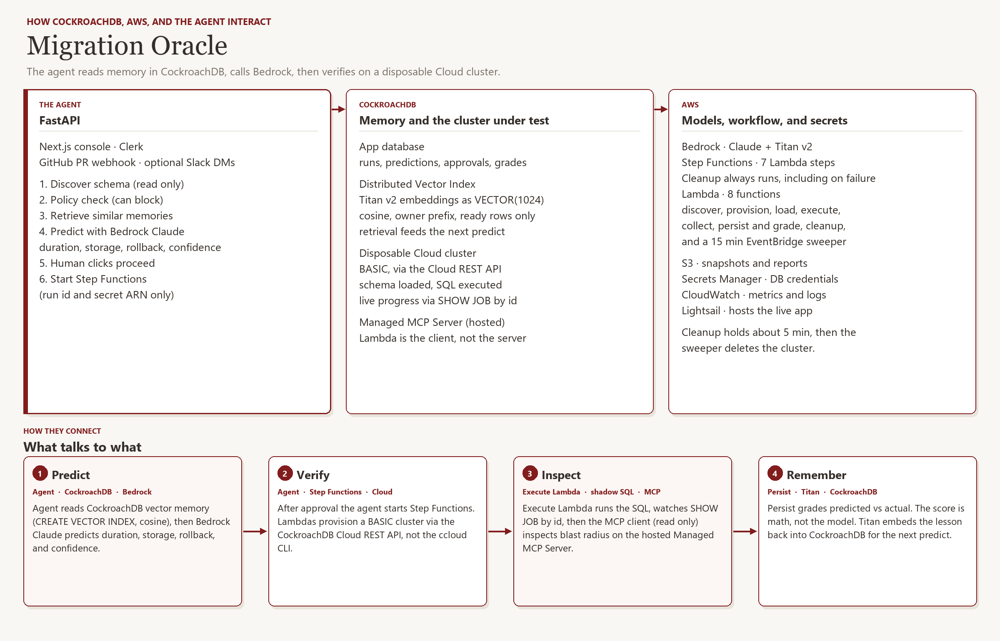
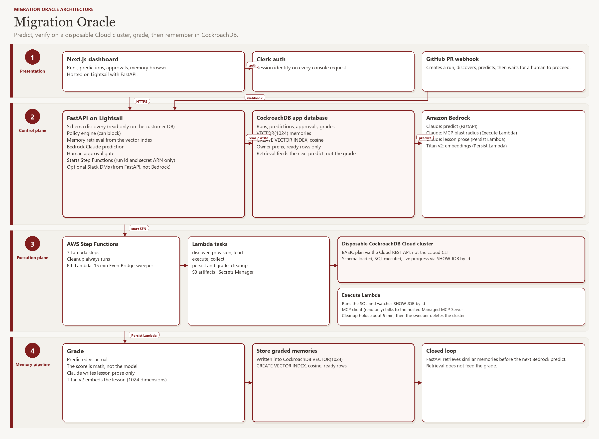

# Migration Oracle

**Predict → verify on a real cluster → grade → remember.**

Migration Oracle is an agentic advisor for database schema changes. It forecasts what a migration will do, runs it on a disposable CockroachDB Cloud cluster, compares the forecast to what actually happened, and stores the result so the next similar change is not a cold guess.

Built for the [CockroachDB × AWS Hackathon](https://cockroachdb-ai.devpost.com/).

**[Try the live app →](https://migration-oracle.b8db7agdvksda.us-east-1.cs.amazonlightsail.com)**

<p align="center">
  
</p>

## The loop

Most migration tools stop at a warning. We run the SQL somewhere safe first, score ourselves, and write the outcome back into memory.

| Step | What happens |
| --- | --- |
| **Predict** | Read only schema discovery, policy check, retrieval from a CockroachDB vector index, then Bedrock Claude (duration, storage, rollback, confidence). |
| **Approve** | A human clicks proceed. Nothing is provisioned before that. |
| **Verify** | Step Functions and Lambda provision a BASIC cluster via the Cloud REST API, load schema and seed, execute the SQL. |
| **Inspect** | `SHOW JOB` on the shadow cluster for progress. Changefeeds write row events to S3 for the tables touched (they do not drive the spinner). Execute Lambda uses the hosted Managed MCP Server as a read only client. |
| **Remember** | The grade score is math (predicted vs actual). Claude writes the lesson. Titan v2 embeds it into `VECTOR(1024)` for the next predict. |

Discovery uses read only credentials. Write capable URLs are rejected. Production never receives the migration SQL.

Slack can DM you when a prediction is ready. A linked GitHub repo can open a PR comment on migration files. Shadow execution still requires approval in the app.

## CockroachDB and AWS in this project

**CockroachDB**

**App database.** Runs, predictions, approvals, grades.

**Distributed Vector Index.** Titan v2 `VECTOR(1024)`, cosine, owner prefix, ready rows only. Retrieval feeds the next predict, not the grade.

**Shadow cluster.** Disposable BASIC cluster via the Cloud REST API (not the ccloud CLI).

**Job watch.** `SHOW JOB` by id, then a `SHOW JOBS` snapshot.

**Changefeeds.** Row events to S3 on the tables the SQL touches.

**Managed MCP Server.** Lambda is the client at `https://cockroachlabs.cloud/mcp`. Write tools are stripped.

**AWS**

Lightsail hosts the Next.js console and FastAPI agent. After proceed, Step Functions runs discover, provision, load, execute, collect, persist and grade, and cleanup, plus an EventBridge sweeper every fifteen minutes. Secrets Manager holds credentials; the workflow only gets a run id and secret ARN. S3 stores snapshots, reports, and changefeed output. Bedrock Claude predicts and inspects. Titan embeds. Cleanup always runs, holds the cluster about five minutes for inspection, then the sweeper tears it down.

<p align="center">
  
</p>

## Stack

Next.js, FastAPI, CockroachDB Cloud, Amazon Bedrock (Claude and Titan v2), Step Functions, Lambda, S3, Secrets Manager, CloudWatch, EventBridge, Clerk, Lightsail (us-east-1).

## Run locally

The AWS execution plane is already deployed. You do not need SAM, Docker, or the AWS CLI for a normal demo.

You need Git, Python 3.12+, Node 20+, a filled repo-root `.env` (never commit it), and network access to AWS us-east-1 and CockroachDB Cloud.

`scripts/dev.py` defaults to port **8003**. The Next.js client defaults to **8000**. Point them at the same port in `.env.local`.

```bash
python scripts/dev.py setup
python scripts/dev.py restart
```

```bash
cd frontend/oracle && npm install && npm run dev
```

`frontend/oracle/apps/web/.env.local`:

```text
NEXT_PUBLIC_API_BASE_URL=http://127.0.0.1:8003
```

Open [localhost:3000](http://localhost:3000). Check [localhost:8003/health](http://127.0.0.1:8003/health) for `sfn_ready: true`.

Typical path: New Migration, attach a read only database, Discover, Predict, Proceed, Start shadow, then grade and memory (about one to two minutes on a real BASIC cluster).

Windows: `.\restart.ps1`. Wiring check: `python scripts/dev.py doctor`.

## Memory corpus

The Memory browser includes 19 curated open source migration incidents in `backend/data/open_source_corpus/` (sources like Temporal, Airflow, Superset, NetBox). Each row has a source URL, is labeled not a graded shadow run, and is excluded from accuracy metrics. One entry is incident context from a Mattermost migration file (AGPLv3 source). This repo remains MIT.

The closed loop learns from your shadow verified grades, written back as Titan embeddings. The seed set is small on purpose: context, not a fake production history.

## License

MIT. See [LICENSE](LICENSE). Copyright 2026 Samrita Khurana and Samved Mamillapalli.
